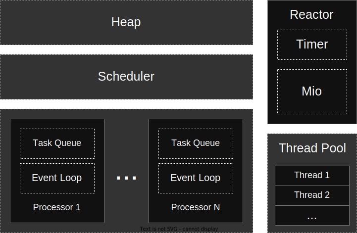

### Scheduler

Files: `src/scheduler/`

Tasks are allocated on the heap.
The scheduler operates independently from the executor and is responsible for scheduling tasks to the processor's task queue.

### Executor

The executor has N processors, typically one per CPU thread, each with its own task queue.
The processor executes tasks by calling the poll method.

### Thread Pool

File: `src/blocking.rs`

Mirrors the functionality of the Tokio thread pool.

1. Dynamically spawn additional blocking threads as needed, up to a configurable upper limit (512 threads by default).
2. Inactive worker threads are automatically terminated after being idle for a configurable timeout period (10 seconds by default).

### Reactor

Reactor responsible for efficiently handling asynchronous events.
It enables non-blocking I/O (e.g. TCP, UDP) and timers.